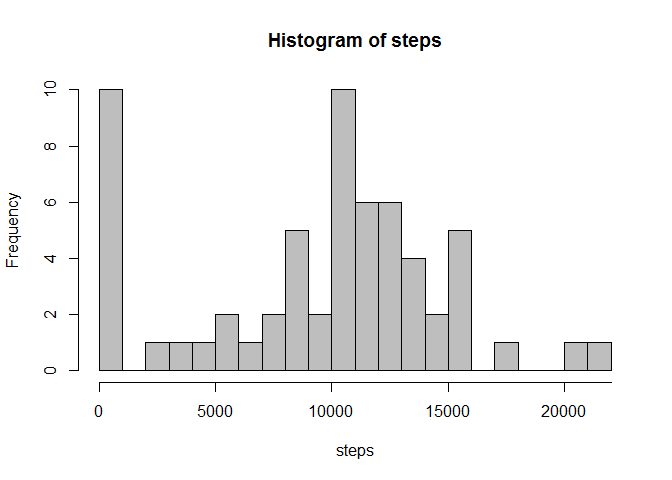
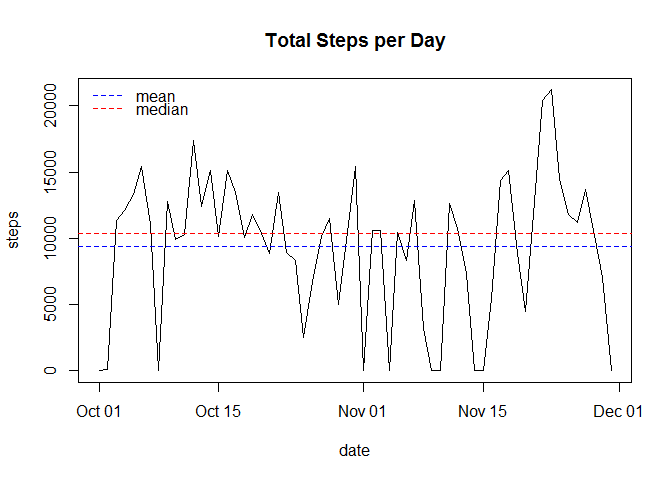
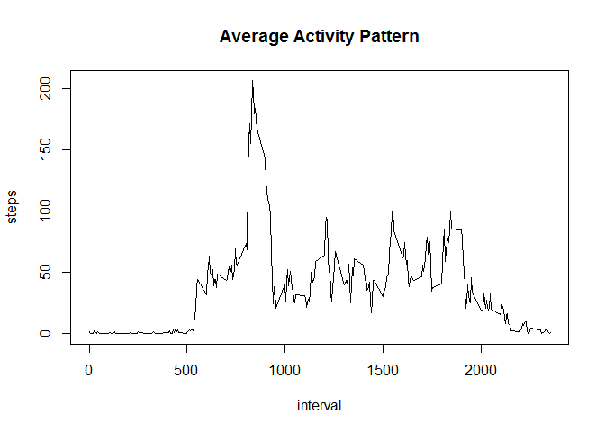
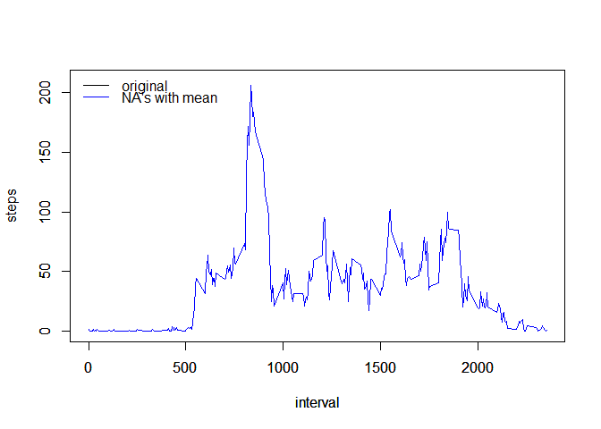
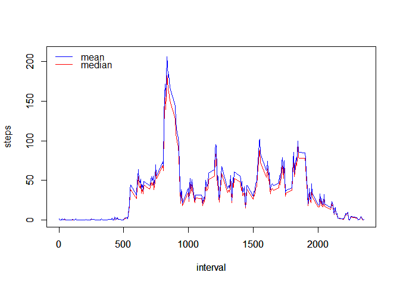
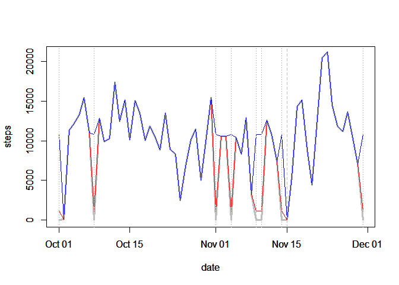
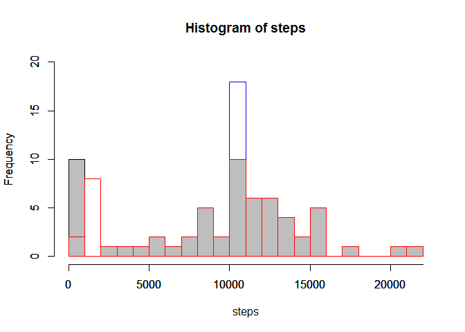
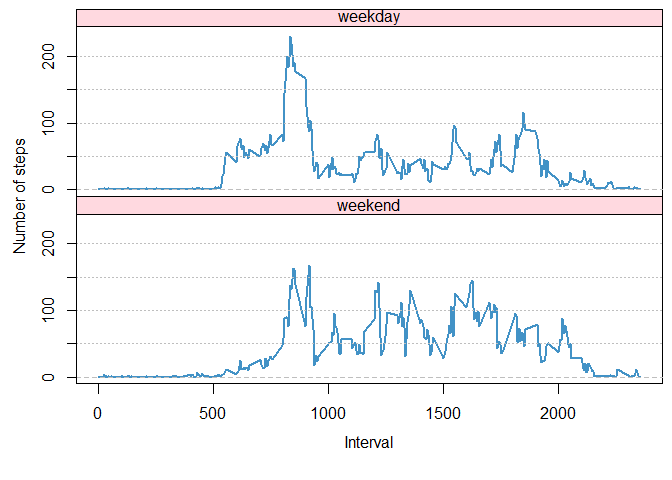

# Reproducible Research: Peer Assessment 1

```r
knitr::opts_chunk$set(echo = TRUE)
```

## Loading and preprocessing the data
First, load the data set and convert the dates into date format.


```r
activity <- read.csv(unz('activity.zip', 'activity.csv'),
                     stringsAsFactors = FALSE)
activity$date <- lubridate::as_date(activity$date)
head(activity)
```

```
##   steps       date interval
## 1    NA 2012-10-01        0
## 2    NA 2012-10-01        5
## 3    NA 2012-10-01       10
## 4    NA 2012-10-01       15
## 5    NA 2012-10-01       20
## 6    NA 2012-10-01       25
```

These NA's have to be dealt with. We'll look into this later.

## What is mean total number of steps taken per day?

```r
require(dplyr)
daily <- activity %>% group_by(date) %>% summarise(steps = sum(steps, na.rm=TRUE))
hist(daily$steps, breaks=20,
     xlab="steps",
     main = "Histogram of steps",
     col='grey')
axis(1, at=seq(0,22000,by=1000),
     labels=FALSE,
     tcl=0)
```

<!-- -->

```r
mean <- round(mean(daily$steps),0)
median <- median(daily$steps)
plot(steps ~ date, dat=daily, type='l',
     main='Total Steps per Day')
abline(h=mean, lty='dashed', col='blue')
abline(h=median, lty='dashed', col='red')
legend("topleft", legend=c('mean', 'median'),
       lty='dashed',
       col=c('blue','red'),
       pt.cex=2,
       y.intersp = 0.7,
       bty='n')
```

<!-- -->

The daily mean and median are 9354 and 10395 steps, respectively.


## What is the average daily activity pattern?

```r
interval <- activity %>% group_by(interval) %>% summarize(steps=mean(steps, na.rm=TRUE))
max <- interval %>% filter(steps==max(interval$steps))
plot(steps ~ interval, dat=interval, type='l',
     main='Average Activity Pattern')
```

<!-- -->

The max steps is 206 at interval 835.


## Imputing missing values
Let's compare the estimates when we impute with the mean and median of steps per interval to each NA.


```r
nas <- table(is.na(activity$steps))
medians <- activity %>% group_by(interval) %>%
    summarise(medians=median(steps, na.rm=TRUE))
means <- activity %>% group_by(interval) %>%
    summarise(means=mean(steps, na.rm=TRUE))
replacement <- medians %>% inner_join(means,
                                      by=c("interval"="interval"))
activity <- activity %>% inner_join(replacement,
                                    by=c('interval'='interval')) %>%
    mutate(impmedian=ifelse(is.na(steps),medians, steps),
           impmean=ifelse(is.na(steps),means, steps))
```

There are 2304 NA's out of the 17568 records.
Now let's plot and compare. I expect the estimates using the mean to exactly be the same as the estimates without imputation.


```r
interval2 <- activity %>% 
    group_by(interval) %>% 
    summarize(impmedian=mean(impmedian, na.rm=TRUE),
              impmean=mean(impmean, na.rm=TRUE))

interval %>% 
    inner_join(interval2, by=c('interval'='interval')) %>%
    select(-impmedian) %>%
    mutate(same=steps==impmean) %>%
    select(same) %>%
    unlist() %>%
    table()
```

```
## .
## TRUE 
##  288
```

```r
plot(steps ~ interval, dat=interval, type='l',
     ylim=c(0,210))
par(new=TRUE)
plot(impmean ~ interval, dat=interval2, type='l', col='blue',
     ylim=c(0,210),
     ylab='')
legend("topleft", legend=c('original', 'NA\'s with mean'),
       lty='solid',
       col=c('black','blue'),
       pt.cex=2,
       y.intersp = 0.7,
       bty='n')
```

<!-- -->

In fact, the plot above shows a complete overlap between the two.

Now let's compare the Average Activity Pattern between the datasets imputed using the mean and median.


```r
plot(impmedian ~ interval, dat=interval2, type='l', col='red',
     ylim=c(0,210),
     ylab='steps')
par(new=TRUE)
plot(impmean ~ interval, dat=interval2, type='l', col='blue',
     ylim=c(0,210),
     ylab='')
legend("topleft", legend=c('mean', 'median'),
       lty='solid',
       col=c('blue','red'),
       pt.cex=2,
       y.intersp = 0.7,
       bty='n')
```

<!-- -->

Using the mean increases the average activity per interval over the estimates given by using the median. What effect does this have on the Total Steps per Day?


```r
daily2 <- activity %>% group_by(date) %>% 
    summarize(impmedian=sum(impmedian, na.rm=TRUE),
              impmean=sum(impmean, na.rm=TRUE))

plot(steps ~ date, dat=daily, type='l', col='grey',
     ylim=c(0,21000),
     lwd=3,
     ylab='steps')
par(new=TRUE)
plot(impmedian ~ date, dat=daily2, type='l', col='red',
     ylim=c(0,21000),
     ylab='steps')
par(new=TRUE)
plot(impmean ~ date, dat=daily2, type='l', col='blue',
     ylim=c(0,21000),
     ylab='steps')
abline(v=unlist(daily %>% filter(steps==0) %>% select(date)),
       lty='dotted', col='grey',
       lwd=0.8)
abline(v=lubridate::as_date('2012-11-15'),
       lty='dashed', col='grey',
       lwd=0.8)
```

<!-- -->

It seems that using the median barely changes the total activity per day for days with 0 activity (arising from either the NAs or from really having no activity). This seems inaccurate, because on November 15, the device wearer really had a low total activity, but not because of the NA's.

In contrast, using the mean gives better estimates for the NA's because the daily total activity will rarely be close to 0. November 15 really is an exception.


```r
hist(daily2$impmean, breaks=22, border='blue', ylim=c(0,20),
     xlab='',
     main = '')
par(new=TRUE)
hist(daily$steps, breaks=22, ylim=c(0,20),
     col='grey',
     xlab='steps',
     main = 'Histogram of steps')
par(new=TRUE)
hist(daily2$impmedian, breaks=22, border='red', ylim=c(0,20),
     xlab='',
     main = '')
axis(1, at=seq(0,22000,by=1000),
     labels=FALSE,
     tcl=0)
```

<!-- -->

```r
mean(daily2$impmean)
```

```
## [1] 10766.19
```

```r
median(daily2$impmean)
```

```
## [1] 10766.19
```


## Are there differences in activity patterns between weekdays and weekends?


```r
new.activity <- activity %>% mutate(steps=impmean) %>%
    select(1:3) %>%
    mutate(wdwe = ifelse(weekdays(date) %in% c("Saturday",
                                               "Sunday"),
                         "Weekend",
                         "Weekday"))
wdwe.activity <- new.activity %>%
    group_by(interval, wdwe) %>%
    summarise(steps=mean(steps))

par(mfrow=c(2,1),
    mai=c(0,0,0,0),
    omi=c(1,0.8,0.1,0.1))
for (i in c("Weekday", "Weekend")) {
    plot(steps~interval,
         dat=(wdwe.activity %>% filter(wdwe==i)),
         type="l",
         ylim=c(0,260),
         col=RColorBrewer::brewer.pal(9,'Blues')[6],
         xaxt=ifelse(which(i==c('Weekday', 'Weekend'))==1,
                     'n', 's'),
         lwd=2,
         yaxt='n')
    legend('top',bg=scales::alpha('pink',0.6), legend="",
           text.width=10000,
           y.intersp = 0.5,
           cex=0.6)
    box()
    text(x=2355/2, y=260, labels=tolower(i))
    abline(h=c(50,100,150,200), lty='dotted',
           col='grey')
    abline(h=0, lty='dashed',
       col='grey')
    axis(2,
         at=seq(0,200,by=50),
         labels=c(0,'',100,'',200))
}
mtext(side=1, 'Interval', outer=T,
      line=2.5)
mtext(side=2, 'Number of steps', outer=T,
      line=2.5)
```

<!-- -->

There is a difference in average activity between weekdays and weekends!

It seems that the device wearer started having activity earlier on  weekdays, where activity spikes to over 150 steps from interval 815 to 900. What if this guy was on his way to the office?
His activity during weekdays after the spike does drop again considerably, perhaps because he just sits around in the office working. Activity picks up again later in the day, leading to another peak at interval 1845. Is this the time when he is on his way home?

Activity on the weekends is a different story. On weekends, there doesn't seem to be any urgency to have bursts of activity as during the morning weekday rush hour. On average, activity rarely goes over 150 steps per interval. However, this guy seems to have more activity in the afternoon as compared to weekday afternoons, which I assumed is time he spends in the office.


